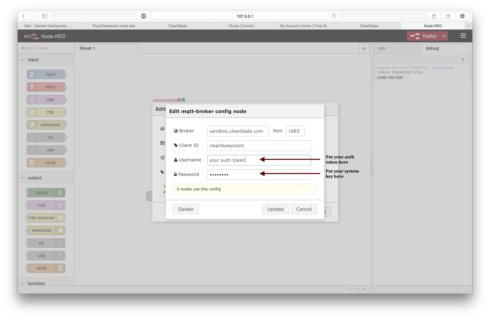

# MQTT using Node Red

### Install and start Node Red
- Follow instructions to install and startup Node Red from http://nodered.org  

### Create MQTT publish and subscribe nodes
- Drag and drop MQTT publish and subscribe nodes and edit the connection information in either of the nodes.  
  

- Setup the publish node
  

- Setup the subscribe node
  

- Drag and drop an inject node to inject messages into the MQTT publish node and connect the two  
  

- Edit the inject node to inject a 'string'
  

- Add and connect a debug node after the MQTT subscribe node to receive the incoming messages in the debug tab
  

- Hit **Deploy** and check for incoming messages in the debug tab  
 
